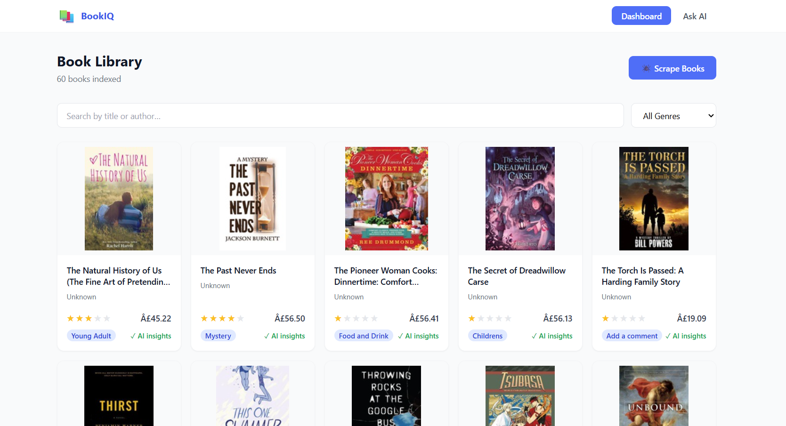
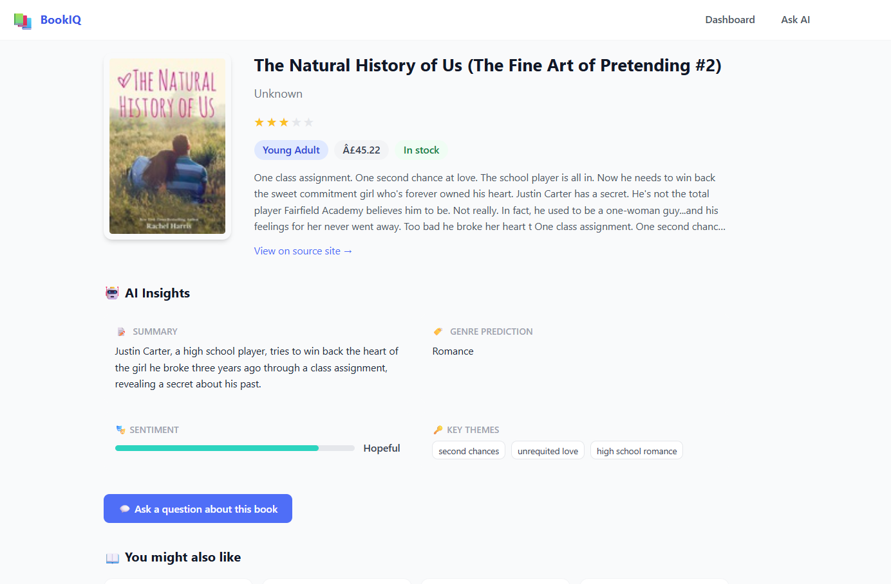
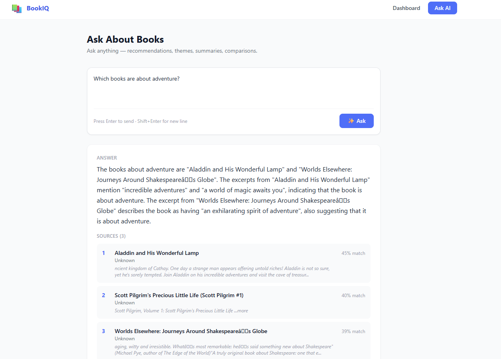
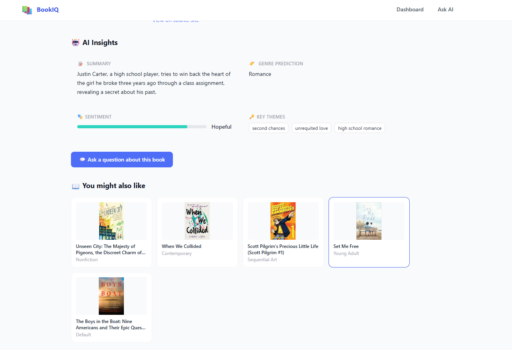

# BookIQ — Document Intelligence Platform

A full-stack AI-powered web application that scrapes books, generates insights using **Groq LLaMA (free)**, and answers questions using a complete **RAG (Retrieval-Augmented Generation)** pipeline.

> Built for the Python Developer Internship Assignment

---

## Screenshots

### Dashboard — Book Listing


### Book Detail — AI Insights


### Q&A Interface — Ask Questions with Source Citations


### Recommendations


---

## Tech Stack

| Layer | Technology | Cost |
|---|---|---|
| Frontend | React 18, React Router, Tailwind CSS | Free |
| Backend | Django 4.2, Django REST Framework | Free |
| Database | SQLite (dev) / MySQL (prod) | Free |
| Vector DB | ChromaDB | Free |
| Embeddings | sentence-transformers (all-MiniLM-L6-v2) | Free / Local |
| LLM | Groq API — LLaMA 3.1 8b + 3.3 70b | Free |
| Scraping | requests + BeautifulSoup4 + Selenium | Free |

**100% free stack. No credit card needed.**

---

## Architecture

```
Frontend (React + Tailwind CSS)
         ↓ REST API
Backend (Django REST Framework)
    ├── Scraper      → books.toscrape.com
    │                  requests + BeautifulSoup (primary)
    │                  Selenium (fallback for JS pages)
    ├── AI Insights  → Groq llama-3.1-8b
    │                  Summary · Genre · Sentiment · Themes
    └── RAG Pipeline → sentence-transformers embeddings
                       ChromaDB vector store
                       Groq llama-3.3-70b answer generation
         ↓
SQLite (metadata) + ChromaDB (vectors)
```

---

## Features Implemented

### Backend (Django REST Framework)
| Endpoint | Method | Description |
|---|---|---|
| `/api/books/` | GET | List all books with search, genre filter, pagination |
| `/api/books/:id/` | GET | Full book detail with AI insights |
| `/api/books/:id/recommend/` | GET | Similar books via embedding similarity |
| `/api/books/upload/` | POST | Trigger scraping + AI processing |
| `/api/books/ask/` | POST | RAG Q&A with source citations |
| `/api/books/history/` | GET | Saved chat history |

### AI Insights (Groq LLaMA)
- **Summary** — 2-3 sentence book summary
- **Genre Classification** — predicted genre from description
- **Sentiment Analysis** — tone with 0-1 positivity score
- **Key Themes** — 3-5 extracted themes

### RAG Pipeline
1. Book descriptions split into overlapping chunks (400 chars, 80 overlap)
2. Chunks embedded with `all-MiniLM-L6-v2` → stored in ChromaDB
3. User question embedded → cosine similarity search → top-5 chunks
4. Context passed to Groq LLaMA 70b → answer with source citations

### Frontend (React + Tailwind)
- **Dashboard** — book grid, search by title/author, genre filter, pagination
- **Book Detail** — cover, metadata, AI insights panel, recommendations
- **Q&A Interface** — ask questions, see answers with source citations, chat history

### Scraping
- **Primary** — requests + BeautifulSoup (fast, 20 books/page)
- **Fallback** — Selenium ChromeDriver (handles JS pages)
- Scrapes title, author, rating, price, description, genre, cover image

### Bonus Features
- ✅ AI response caching (24h TTL — no repeated API calls)
- ✅ Embedding-based similarity recommendations
- ✅ Overlapping chunk strategy for better RAG recall
- ✅ Chat history persistence
- ✅ Search + genre filter
- ✅ Pagination

---

## Setup Instructions

### Prerequisites
- Python 3.10+
- Node.js 18+
- Free Groq API key → https://console.groq.com (sign up with Google, no card)

### Step 1 — Clone
```bash
git clone https://github.com/Ra59s-Das/Book-Intelligence.git
cd Book-Intelligence
```

### Step 2 — Backend
```bash
cd backend
python -m venv venv
source venv/bin/activate        # Windows: venv\Scripts\activate
pip install -r requirements.txt
cp .env.example .env
# Edit .env → add GROQ_API_KEY=gsk_...
python manage.py migrate
python manage.py createcachetable
python manage.py runserver
```

### Step 3 — Frontend (new terminal)
```bash
cd frontend
npm install
npm start
```

### Step 4 — Scrape books
```bash
# Option A: Click "Scrape Books" button in the UI
# Option B: Terminal (more control)
python manage.py scrape_books --pages 10   # = 200 books
```

---

## Sample Q&A

**Q: What are some highly rated books?**
> Based on the library, several books have 5-star ratings including "The Secret Garden" and "Tipping the Velvet". Both are in the Fiction category and received the highest possible rating...

**Q: Recommend a dark suspenseful book**
> I recommend "In a Dark, Dark Wood" which has a consistently dark tone. The description mentions psychological tension and isolation themes. "Sharp Objects" is another strong option in the Mystery genre...

**Q: What self-help books are available?**
> The library contains several Self-Help titles. "The Four Agreements" focuses on personal freedom and practical wisdom. "Reasons to Stay Alive" deals with themes of mental health and recovery...

---

## Project Structure

```
Book-Intelligence/
├── backend/
│   ├── config/          settings.py, urls.py, wsgi.py
│   ├── books/           models, serializers, views, urls, admin
│   ├── scraper/         scraper.py (requests+BS4+Selenium), management command
│   ├── ai_engine/       groq_client.py, insights.py, rag.py
│   ├── utils/           helpers
│   ├── manage.py
│   └── requirements.txt
├── frontend/
│   ├── src/
│   │   ├── api/         client.js — all axios calls
│   │   ├── components/  BookCard, AnswerDisplay, Navbar
│   │   └── pages/       Dashboard, BookDetail, QAInterface
│   └── package.json
├── screenshots/         UI screenshots
├── setup.sh             one-click setup
└── README.md
```

---

## API Documentation

### GET `/api/books/`
```json
{
  "count": 200,
  "page": 1,
  "total_pages": 10,
  "results": [
    {
      "id": 1,
      "title": "A Light in the Attic",
      "rating": 3.0,
      "genre": "Poetry",
      "price": "£51.77",
      "is_processed": true
    }
  ]
}
```

### POST `/api/books/ask/`
Request:
```json
{ "question": "What mystery books are available?", "book_id": null }
```
Response:
```json
{
  "answer": "Based on the library, I recommend Sharp Objects...",
  "sources": [
    {
      "book_id": 4,
      "book_title": "Sharp Objects",
      "excerpt": "A haunting psychological thriller...",
      "relevance_score": 0.847
    }
  ]
}
```
